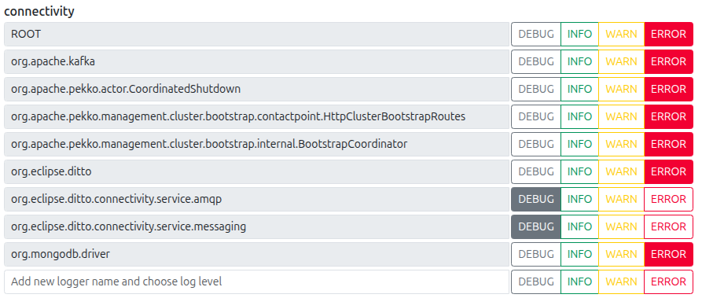

## Feature update delay

Three folders are necessary to create, in order to store time checkpoints, time interval results, and charts.

### Time intervals measured

- **Local Twin -> Hono**:
  - Desde: `time.time()` quando mensagem de telemetria é enviada pelo Local Twin;
  - Até: `timestamp` quando mensagem chega ao Hono; (Feito com tcpdump no container de MQTT Adapter)
- **Hono -> Ditto**
  - Desde: `timestamp` quando mensagem chega ao Hono; (Igual acima)
  - Até: `timestamp` quando mensagem chega ao Ditto; (Obtido nos logs do c2e-ditto-connectivity)
- **Ditto -> WS Client**
  - Desde: `timestamp` quando mensagem chega ao Ditto; (Igual acima)
  - Até: `time.time()` quando notificação de atualização de feature chega ao WS Client.
- **E2E Total Delay**

### Obtaining time CHECKPOINTS

1. TCP dump no container hono adapter, com imagem que inclui network packages:
    1. `kubectl debug -n cloud2edge -it c2e-hono-adapter-mqtt-5b5fcd88df-p284b   --image=nicolaka/netshoot --target=adapter-mqtt`
    2. `tcpdump -i any port 8883 -tt > tcp_dump.log`

2. Correr `modemStatus-to-feature2.py` (corresponde ao websocket client) no agente

3. Correr `local-twin.py`, na OBU (10000 samples de modemStatus)

4. Correr `data-collector`, na OBU
  **ESPERAR**

5. Copiar tcpdump log para meu pc e extrair apenas os tempos dos pacotes relevantes (remove 3-way handshake (SYN+ACK), TLS handshake, and MQTT Connection phase at the start; remove the FIN handshake at the end; only leave In packets) (no MEC):
    1. `scp tcp_dump.log talves@172.16.10.27:~/Documentos/bolsa/DigitalTwin/tests4-feature-update/day2_10000messages/checkpoints`
    2. remove unnecessary packets
    3. `awk '/In/ && /Flags \[P\.\]/ && /length/ {print $1}' tcp_dump.log > hono_arrivals.txt` (to print with packet size: `awk '/In/ && /Flags \[P\.\]/ && /length/ {print $1, $NF}' tcp_dump.log > hono_arrivals.txt`)

6. Obter logs do ditto e ws-receive-times.txt (no MEC):
    - Logs:
        - `kubectl logs -n cloud2edge deployment/c2e-ditto-connectivity | grep "Acking" | jq -r '."@timestamp"' > ditto_arrivals.txt`
        - `scp ditto_arrivals.txt talves@172.16.10.27:~/Documentos/bolsa/DigitalTwin/tests4-feature-update/day2_10000messages/checkpoints`
    - WS Receive times:
        - `scp ws-receive-times.txt talves@172.16.10.27:~/Documentos/bolsa/DigitalTwin/tests4-feature-update/day2_10000messages/checkpoints`

7. Obter send-times.txt, escritos pelo Local Twin (na OBU):
    - `scp send_times.txt talves@172.16.10.27:~/Documentos/bolsa/DigitalTwin/tests4-feature-update/day2_10000messages/checkpoints`

### Calculating time intervals (RESULTS)

1. Correr `obu-to-hono-delay.py` para obter *obu-to-hono-delays.csv*
2. Correr `hono-to-ditto-delay.py` para obter *hono-to-ditto-delays.csv*
3. Correr `ditto-to-ws-delay.py` para obter *ditto-to-ws-delays.csv*
4. Correr `SUM_ALL.py` para obter *total-delays.csv*

### Generating the CHARTS

- `multiple-boxplot.py`
- `multiple-cdf.py`
- `one-stacked-bar-chart.py`
- `stacked-bar-chart.py`

---

**NOTA:** Para deixar apenas a mensagem de log relevante, no Ditto Services Logging deixa-se apenas o logger *org.eclipse.ditto.connectivity.service.messaging* ou *org.eclipse.ditto.connectivity.service.amqp* a emitir info:

**NOTA:** O tamanho default dos logs dos pods é de 10 MiB (com log rotation), e existem no máximo 5 ficheiros de logs. Estes dois valores podem ser alterados para serem feitos testes mais longos.

**EXTRA:** Receive times com logs do container mqtt adapter (creio que tem mensagens repetidas...): `kubectl logs -n cloud2edge deployment/c2e-hono-adapter-mqtt   | grep "no payload mapping configured for device"   | tail -n 1000  | awk '{print $2}' > hono_receive_times.txt`

---