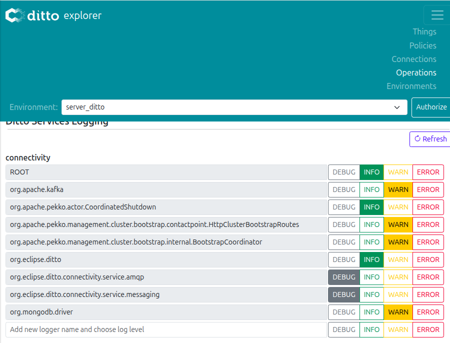

# O que correr antes para tudo dar certo:
- tcpdump no container do HONO (1 processo);
- verificar que os logs de conexão do DITTO estão resetados e ligados;
- correr modemStatus-to-feature2.py (2 processo);
- por último correr local twin a mandar modemStatus;

- POR ULTIMO: obter os tempos de todos os lados para comparar.

## TCP DUMP DENTRO DO CONTAINER MQTT ADAPTER (RECEÇÃO DOS PACOTES NO HONO):

- 1º passo: kubectl debug -n cloud2edge -it c2e-hono-adapter-mqtt-5b5fcd88df-p284b   --image=nicolaka/netshoot --target=adapter-mqtt
                                        <mqtt-adapter-pod>

- 2º passo: tcpdump -i any port 8883 -tt > /tmp/tcp_dump.log

- 3º passo: copy to VSCode; remove the 3-way handshake (SYN+ACK), TLS handshake, and MQTT Connection phase (at the START); remove the FIN handshake (at the END)

- 4º passo: extrair tempos: 
  - awk '/In/ && /Flags \[P\.\]/ && /length/ {print $1}' tcp_dump.log > hono_arrivals.txt

> To print with packet size:
> awk '/In/ && /Flags \[P\.\]/ && /length/ {print $1, $NF}' tcp_dump.log > hono_arrivals.txt

> TODO: Test with both ports 1883 and 8883

**RECEIVE TIMES COM LOGS DO CONTAINER MQTT ADAPTER:**

- kubectl logs -n cloud2edge deployment/c2e-hono-adapter-mqtt   | grep "no payload mapping configured for device"   | tail -n 1000   | awk '{print $2}' > hono_receive_times.txt

**TCP DUMP DENTRO DO CONTAINER HONO ARTEMIS:**

- kubectl debug -n cloud2edge -it c2e-hono-artemis-65d96c95b6-c46w6   --image=nicolaka/netshoot --target=apache-activemq-artemis

## LOGS DA CONEXAO AMQP NO DITTO (RECEÇÃO DOS PACOTES NO DITTO):

NA UI DO DITTO:
- 1º passo: Dar reset aos Connection Logs

- 2º passo: Voltar a dar enable

- 3º passo: Verificar se estes 2 serviços (imagem) estão com DEBUG em Ditto Services Logging: 

NO CONTAINER DA CONNECTIVITY:
- 4º passo: kubectl logs -n cloud2edge deployment/c2e-ditto-connectivity | grep "Acking" | jq -r '."@timestamp"'

- 5º passo: Copiar os tempos para ditto_arrivals.txt

> TODO: Verificar o tempo de processamento: mensagem já foi transformada em feature está pronta a ser retrieved por aplicaçoes: ... | grep "ModifyFeaturePropertiesResponse" -> Ver melhor porque não dá igual número de mensagens às enviadas a partir da OBU

> Para contar e ver se está correto: kubectl logs -n cloud2edge deployment/c2e-ditto-connectivity | grep "Acking" | wc -l